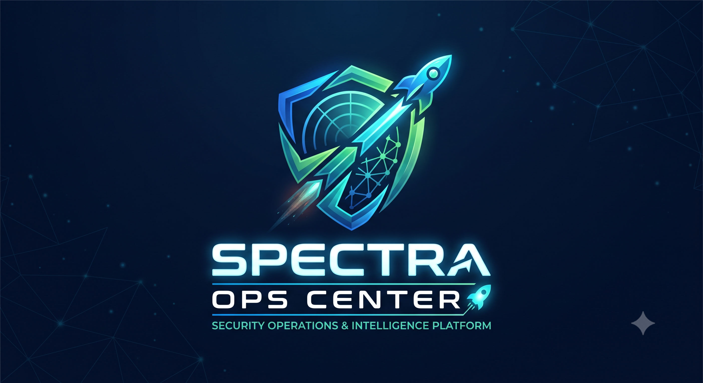

<p align="center">
  
</p>

# 🚀 SPECTRA OPS CENTER
### *Security Operations, Posture & Intelligence Platform*
**Engineered by IVM Team (Barath & Dhinakaran) · Continuous Posture & Threat Defense**

---

```
   ███████╗██████╗ ███████╗ ██████╗████████╗██████╗  █████╗ 
   ██╔════╝██╔══██╗██╔════╝██╔════╝╚══██╔══╝██╔══██╗██╔══██╗
   ███████╗██████╔╝█████╗  ██║        ██║   ██████╔╝███████║
   ╚════██║██╔═══╝ ██╔══╝  ██║        ██║   ██╔══██╗██╔══██║
   ███████║██║     ███████╗╚██████╗   ██║   ██║  ██║██║  ██║
   ╚══════╝╚═╝     ╚══════╝ ╚═════╝   ╚═╝   ╚═╝  ╚═╝╚═╝  ╚═╝
   
      S E C U R I T Y   P O S T U R E ,   E V A L U A T I O N ,
  C O M P L I A N C E ,   T H R E A T   &   R I S K   A N A L Y T I C S
```

> **NEXT-GEN UNIFIED CYBER COMMAND · 100% CLIENT-SIDE SECURE EXECUTION**  
> Unified cyber operations fabric engineered for enterprise SecOps, IVM, and AppSec teams. Streamline finding correlation, aging metrics calculation, and automated stakeholder remediation with **zero data exfiltration**.

📖 **[Read the Full Origin Story & Engineering Genesis](STORYLINE.md)**

---

## 🌟 Architecture & Operational Guide

```
┌──────────────────────────────────────────────────────────────────────────────────┐
│                            SPECTRA OPERATIONS CENTER                             │
├──────────────────────────┬──────────────────────────┬────────────────────────────┤
│      SPECTRA RADAR       │      SPECTRA FORGE       │      SPECTRA DISPATCH      │
│  (Risk & Metrics Hub)    │   (Correlation Engine)   │  (Remediation Automator)   │
│ ──────────────────────── │ ──────────────────────── │ ────────────────────────── │
│ • 0–365+ Day Age Bands   │ • Dual Ingestion (Srv+Net│ • Automated Owner Nudges   │
│ • Executive Heatmaps     │ • Sev 1 & 2 Auto-Strip   │ • Aptos 11 Outlook HTML    │
│ • IF / PCI Segmentation  │ • Multi-Cloud State Ret. │ • SLA Breach Escalation    │
│ • PowerPoint/PDF Export  │ • 3-Tier CMDB Ownership  │ • IST Timezone Precision   │
│ • 23-Col Normalizer      │ • 54-Col IASP & PowerBI  │ • DOSS Timeline Matrices   │
└──────────────────────────┴──────────────────────────┴────────────────────────────┘
```

### 1. 📡 SPECTRA RADAR (`SecureMetrics Hub.html`)
*Risk & Metrics Intelligence · Aging calculation, SLA compliance, and cross-framework analytics.*
* **100% In-Browser Analytical Processing**: Parses raw vulnerability scan reports, computes real-time aging matrix buckets (`0–365+` days), verifies SLA status, and presents executive dashboards without sending a single byte to an external server.
* **Asset Criticality Segmentation**: Real-time division across **IF (Internet Facing)**, **PCI**, and internal corporate infrastructure.
* **Executive Multi-Format Reporting**: One-click exports to **Excel, PDF, CSV & PowerPoint**.

### 2. ⚙️ SPECTRA FORGE (`VulnOps_Reporting_Engine.html`)
*Report & Correlation Engine · Master report generation, cloud inventory correlation, and audit logging.*
* **Automated Multi-Layer Correlation**: Correlates findings against running and stopped AWS/Azure cloud instances, enriches ownership via 3-tier CMDB resolution, applies SLA matrices, and documents all discrepancies in the audit log.
* **Dual Raw Ingestion (Server + Network)**: Merges standard Server raw reports and Network raw reports (preserving `Associated Tags`), while auto-filtering Severity 1 & 2 findings.
* **Multi-Cloud Asset State Retention**: Retains and matches stopped/deallocated AWS and Azure assets for compliance reporting.
* **3-Tier CMDB Ownership Resolution**: Matches via `IP Address` $\rightarrow$ `5-Digit Account Correlation Code` $\rightarrow$ `Hostname / NetBIOS`.
* **Exception Approval Pre-Processor**: Pre-configures APM ID and vulnerability waivers with `Exception Start Date` and `Exception End Date`.
* **Dual Output Schemas**:
  * **IASP Final Outcome**: Exact 54-column compliance schema.
  * **PowerBI Relational Model**: 57-column star-schema (`Fact_Vulnerabilities`, `Dim_Applications`, `Dim_Cloud_Assets`, `Measures_SLA_Summary`, `Fact_Exceptions`).

### 3. 📬 SPECTRA DISPATCH (`Mail Automation.html`)
*Remediation Automation · Stakeholder outreach, SLA breach escalations, Aptos 11 formatting, and PowerBI intelligence.*
* **Accelerated Remediation Cycle**: Closes the loop between technical findings and application teams. Aggregates vulnerabilities per custodian, prepares compliant Outlook HTML email drafts with verified resource links, and renders DOSS timeline matrices formatted in **Aptos 11**.
* **SLA Escalation Matrix**: Highlights critical and overdue items with real-time days-overdue calculations.
* **IST Timezone Localization**: Fully localized in Indian Standard Time (IST) for operational synchronization.

---

## 🎯 The S.P.E.C.T.R.A. Framework Alignment

| Letter | SPECTRA Phase | Enterprise Automation Capability |
| :---: | :--- | :--- |
| **S** | **Scan & Ingest** | **FORGE** ingests Server & Network raw Qualys reports with automated column alias resolution. |
| **P** | **Prioritize & Filter** | **FORGE** strips Severity 1 & 2 noise; **RADAR** evaluates TruRisk, QDS, and CVSS severity profiles. |
| **E** | **Evaluate & Except** | **FORGE** pre-processes formal risk exceptions with strict **Exception Start & End Dates**. |
| **C** | **Correlate & Enrich** | **FORGE** applies 3-tier CMDB matching (IP $\rightarrow$ Code $\rightarrow$ Host) & multi-cloud asset retention. |
| **T** | **Track & SLA Matrix** | **RADAR** computes aging matrix buckets and SLA compliance against IF/PCI asset tiers. |
| **R** | **Remediate & Escalate** | **DISPATCH** drafts personalized Aptos 11 Outlook HTML emails with copyable Excel matrices. |
| **A** | **Audit & Export** | **FORGE** logs all data-quality exceptions and exports 54-col IASP and PowerBI star schemas. |

---

## 🔍 Audit Transparency: Exception Categories

Every data ambiguity in **SPECTRA FORGE** is transparently captured in the Exception Log:
* `Invalid Severity` / `Invalid IP` / `Missing QID`
* `AWS/Azure IP Not Running` *(flagged in PowerBI, retained in IASP)*
* `Duplicate AWS/Azure IP`
* `No Cloud Inventory Match`
* `CMDB Duplicate Match` / `CMDB Match Missing`
* `Missing SLA Config`

---

## 📋 IASP 54-Column Outcome Schema

```tsv
1. IP                     19. Date Last Fixed          37. ARS
2. DNS                    20. First Reopened           38. ACS
3. NetBIOS                21. Last Reopened            39. TruRisk Score
4. Tracking Method        22. Times Reopened           40. IF or PCI
5. OS                     23. CVE ID                   41. Scan Type
6. IP Status              24. Vendor Reference         42. APM ID
7. Unique Id              25. Bugtraq ID               43. SLA
8. Vulnerability Name     26. Threat                   44. App Owner
9. Vulnerability Status   27. Impact                   45. Organization
10. Type                  28. Recommendation           46. Exception Start Date
11. Risk Rating           29. Exploitability           47. Exception End Date
12. Port                  30. Associated Malware       48. IF
13. Protocol              31. Results                  49. PCI
14. FQDN                  32. PCI Vuln                 50. CSP
15. SSL                   33. Ticket State             51. Cloud Account Name
16. First Detected        34. Instance                 52. Environment
17. Last Detected         35. Category                 53. Impacted Asset
18. Times Detected        36. QDS                      54. Vulnerability Category
```

---

## 🚀 Quick Launch

```bash
# Clone the repository
git clone https://github.com/buildxtechs/Vuln-Pilot.git

# Navigate to folder
cd Vuln-Pilot

# Launch the SPECTRA Operations Center
open index.html   # On macOS
# or start index.html on Windows
```

---

### 👨‍💻 Engineering Credits
**SPECTRA Operations Center**  
*Engineered with excellence by the IVM Team (Barath & Dhinakaran)*  
*Continuous Posture & Threat Defense*
